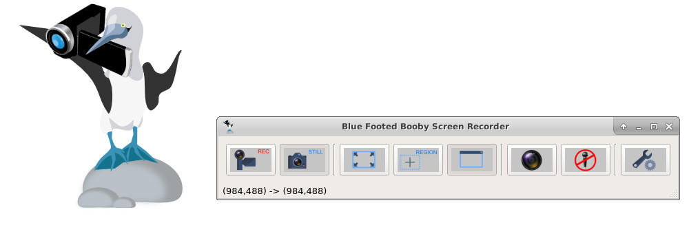

  

  

Are you feeling frustrated trying to capture your screen? Finding it hard to make a video?

  

Blue Footed Booby Screen Recorder makes capturing your screen very easy. Try it!

  

### Capture as Mp4, Ogg, Mkv and even  
Animated GIF images from your Screen  

  

GIF Image

created by Blue Footed Booby Screen Recorder

With the Blue Footed Booby Screen Recorder, you can create

  

-   Mp4 files using H.264 also known as MPEG-4 AVC (MPEG-4 Part 10, Advanced Video Coding) and AAC (Advanced Audio Codec)
-   Ogg files using Theora video codec and Vorbis audio codec
-   Mkv files using VP8 video codec and Vorbis audio codec
-   Gif files, animated, loop forever

Mp4 using H.264 provides the best video format, best compression therefore smallest file size, and best quality.

  

### Select Full Screen, or Region, or Window

Easily, with a click of a button, select to capture the entire screen, or a rectangular region, or click a window to only capture that window.

  

### Multiple Screen Support

If you have multiple screens attached to your computer, just select the screen you want to capture.

### Camera

If you have a video camera, you can turn it on with the click of a button, and start capturing the camera feed along with your screen cast.

  

### Audio

  

Select from multiple audio sources on your computer, or toggle audio off

  

### Runs on Windows and Ubuntu

  

  

  
Blue Footed Booby Screen Recorder is supported on Windows 7 & higher and Ubuntu 14.10 & higher.

  

The free version applies the "Blue Footed Booby watermark" to your videos after two minutes. We hope you will like our screen recorder and purchase a license, the purchased version will not apply our watermark to your videos.
